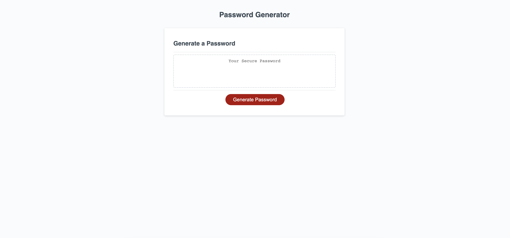
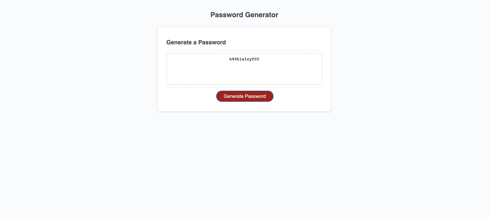

# Password-Generator

## A Secure Random Password Generator
---
The purpose of this project was to build a simple web application that randomly generates secure passwords as according to OWASP standards when requested.

The criteria will be that the User:

  1. Must have the option to choose between a minimum of 8 characters long and a maximum of 128 characters long
  2. Must have the option to contain at least one lower case letter
  3. Must have the option to contain at least one upper case letter
  4. Must have the option to contain at least one special character
  5. Must have the option to contain at least one numerical value

If the user does not properly enter the password criteria requirements, they will be alerted to the invalid input and prompted to enter input again.

    As the final and most important requirement, the password must be generated at random regardless of previously stated conditions.

## Installation
---
N/A

## Usage
---
This web app will be used to generate strong and secure passwords for employees with access to proprietary or sensitive data/information. This can also be used for anyone looking to increase their own security whilst using devices that require users to log in.

The webpage can be found using the link provided

https://corradoj02.github.io/Password-Generator/

This first image represents what the general application looks like before any passwords are generated:

After user click on the "Generate Password" button, a strong password will be immediatedly generated for them. They are then free to copy and paste the password and use it wherever they need.

## Credits
---
N/A

## License
---
N/A